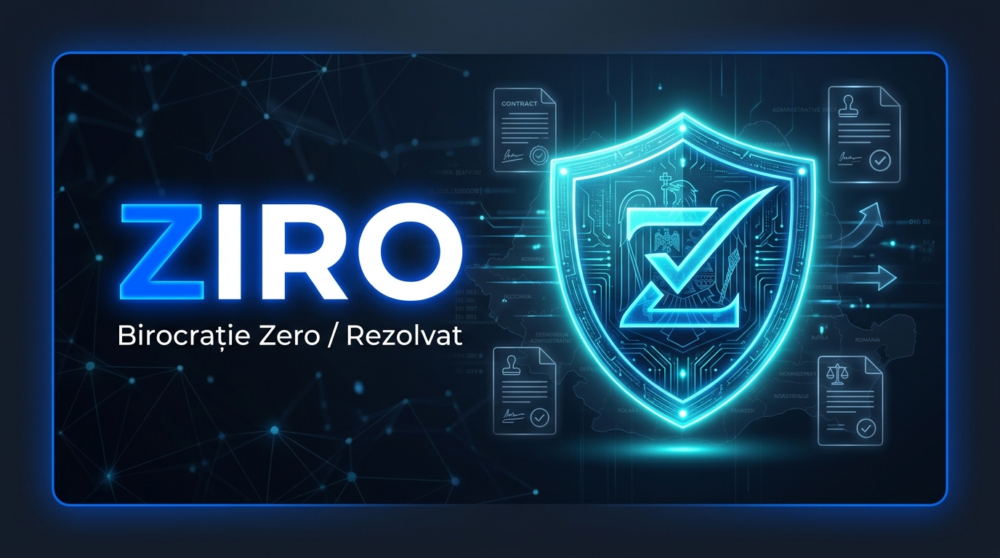
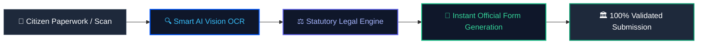
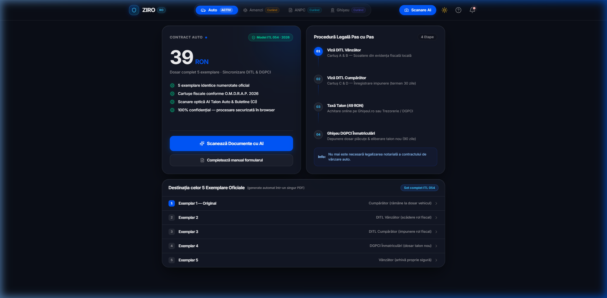
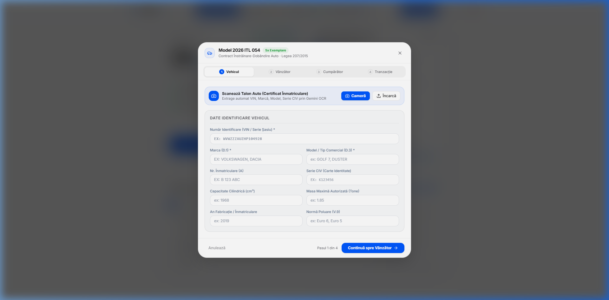
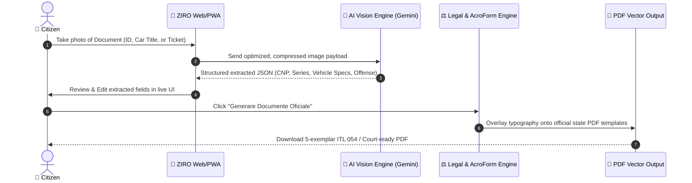

# <p align="center">🏛️ ZIRO — Rezolvat</p>
<p align="center">
  <strong>Digital Citizen Legal Assistant & Official Document Automation for Romania</strong>
</p>

<p align="center">
  
</p>

<p align="center">
  <a href="#-quick-start"></a>
  <a href="#-tech-stack"></a>
  <a href="#-tech-stack"></a>
  <a href="#-tech-stack"></a>
  <a href="#-privacy--legal-compliance"></a>
</p>

---

## Executive Summary: What is ZIRO?

**ZIRO** is a modern, privacy-focused legal assistant and administrative engine designed to eliminate the anxiety, queue fatigue, and friction of Romanian civil bureaucracy.

Every year, millions of Romanian citizens lose countless hours navigating counter queues, dealing with rejected forms due to clerical errors, or accepting unjustified fines simply because drafting a legal challenge (*Plângere Contravențională*) or vehicle transfer packet (*Contract ITL 054*) feels overly complex and expensive.

ZIRO transforms these intimidating paper workflows into **streamlined, 60-second digital procedures** right from your smartphone or desktop browser.



---

## 📱 Application Preview

<table align="center" width="100%">
  <tr>
    <td width="50%" align="center">
      <strong>🌙 Dark Mode Experience</strong><br/><br/>
      
    </td>
    <td width="50%" align="center">
      <strong>📝 Interactive Contract & PDF Editor</strong><br/><br/>
      
    </td>
  </tr>
</table>

---

## Modules & Capabilities

### 1. AutoDox — Used Car Transfer & Registration Suite
Selling or purchasing a vehicle in Romania notoriously requires generating identical contracts for multiple state institutions. **AutoDox** automates this entirely:

* **Official Model ITL 054 (Model 2026)**: Generates the exact 2-page standardized contract in **all 5 legally required identical copies**:
  1. *Exemplar 1 — Cumpărător (Buyer)*
  2. *Exemplar 2 — Vânzător (Seller)*
  3. *Exemplar 3 — Organul Fiscal Local al Vânzătorului (DITL Scoatere)*
  4. *Exemplar 4 — Organul Fiscal Local al Cumpărătorului (DITL Impunere)*
  5. *Exemplar 5 — Serviciul Înmatriculări (DGPCI / DRPCIV)*
* **Pixel-Exact Vector Coordinates**: Uses `pdf-lib` to overlay citizen and vehicle details directly onto the official Ministry of Finance AcroForm coordinates.
* **Dual Camera OCR**: Quickly scans Seller ID, Buyer ID, and Vehicle Identity Card (CIV / Talon) to pre-fill all technical specifications (VIN, cilindree, putere, sarcină maximă, serie CIV).
* **Interactive Administrative Roadmap**: Visual checklist guiding users through municipal tax clearance, the 49 RON registration fee on Ghișeul.ro, and booking the DGPCI counter slot.

---

### 2. AmendaGuard — Traffic & Parking Fine Contester
Traffic tickets (*Proces-Verbal de Constatare a Contravenției*) frequently suffer from procedural or statutory nullities under Romanian law.

* **Legal Nullity Checks (Codified from O.G. nr. 2/2001)**:
  * **Absolute Nullities (Art. 17)**: Detects omissions of the reporting officer's name, unit, offender data, date of offense, or mandatory signature.
  * **Relative Nullities & Procedural Flaws (Art. 16)**: Flags generic accusations lacking concrete factual circumstances, absent or unidentified witnesses, or missing metrological certification for radar speed devices.
* **Instant Court Petition (*Plângere Contravențională*)**: Generates a complete, court-ready civil complaint compliant with the Romanian Code of Civil Procedure (*Codul de Procedură Civilă*).
* **Territorial Jurisdiction Mapping**: Automatically identifies and addresses the exact competent court (*Judecătoria competentă*) and explains how to pay the 20 RON judicial stamp fee (*Taxă Judiciară de Timbru*).

---

### 3. ANPC Express — Consumer Protection & Commercial Disputes
* Automates official dispute filings against uncooperative vendors, airlines, delivery services, and e-commerce merchants.
* Grounds petitions directly in **O.U.G. nr. 34/2014** (14-day online return rights) and **O.G. nr. 21/1992** (consumer guarantees).
* Formats claims with attached digital proof for 1-click submission into the official ANPC digital registry (*reclamatii.anpc.ro*).

---

### 4. GhișeuNavigator — Citizen Paperwork Guides
* Step-by-step interactive flows for renewing expired ID cards (*Cartea de Identitate*).
* Online criminal record generation (*Cazier Judiciar*) via Hub MAI and Ghișeul.ro.
* Obtaining municipal tax certificates (*Certificat de Atestare Fiscală*).

---

## How It Works (Citizen Workflow)



---

## Technical Architecture & Engineering Highlights

```
┌─────────────────────────────────────────────────────────────────────────┐
│                        ZIRO SYSTEM ARCHITECTURE                         │
└─────────────────────────────────────────────────────────────────────────┘
                                     │
                 ┌───────────────────┴───────────────────┐
                 ▼                                       ▼
    [Presentation Layer (PWA)]             [Processing Pipeline]
    ├── React 18 + TypeScript              ├── In-Memory Image Preprocessor
    ├── Tailwind CSS v4                    │   └── 800px Grayscale WebP Optimizer
    ├── Framer Motion Physics Engine       ├── Gemini 2.0 Flash Vision
    ├── Lucide System Icons                │   └── Zero-shot Structured Extractor
    └── Sonner Toast Notification Suite    └── Legal Rules Engine (O.G. 2/2001)
                                                         │
                                                         ▼
                                            [Client-Side Vector Engine]
                                            ├── pdf-lib Binary Synthesizer
                                            ├── High-Res Vector AcroForm Templates
                                            └── 5-Copy Multi-Page Document Pipeline
```

* **Client-Side Document Assembly**: Document rendering is executed directly in the browser via `pdf-lib`. Citizen data does not need to be saved in remote databases to produce the finalized files.
* **Vision OCR Preprocessing**: Images are downsampled to optimal grayscale WebP dimensions before OCR inference, ensuring rapid uploads even on low-bandwidth mobile connections.
* **Micro-Animations & Responsive Design**: Custom adaptive layout that feels native on both iOS Safari, Android Chrome, and desktop screens.
* **Dual Theme Engine**: Seamless light and dark mode support with accessible contrast ratios.

---

## Privacy, Security & Legal Compliance

| Aspect | Guarantee | Details |
| :--- | :--- | :--- |
| **🛡️ GDPR by Design** | Strict Data Minimization | Images and personal identification codes (CNPs) are processed transiently in-memory and are never sold or retained. |
| **💻 Client-Side First** | Local Computation | Forms and PDFs are compiled directly inside your browser sandbox. |
| **⚖️ Statutory Notice** | Law 51/1995 Compliance | ZIRO is an automated administrative tool. It provides automated document formatting and legal information, not personalized legal representation. |

> [!NOTE]
> **Statutory Disclaimer (Conform Legii nr. 51/1995)**:  
> *Platforma ZIRO (Rezolvat) este o platformă tehnologică independentă de asistență administrativă și generare automată de documente standardizate. Aceasta nu acordă consultanță juridică individuală și nu înlocuiește asistența unui avocat autorizat înscris în Barou.*

---

## Tech Stack

* **Frontend Framework**: [React 18](https://react.dev/) + [TypeScript](https://www.typescriptlang.org/)
* **Build System**: [Vite 6](https://vitejs.dev/) with [@tailwindcss/vite](https://tailwindcss.com/)
* **Styling**: [Tailwind CSS v4](https://tailwindcss.com/) with native CSS variables and glassmorphism
* **Animations**: [Framer Motion](https://www.framer.com/motion/)
* **Document Engine**: [pdf-lib](https://pdf-lib.js.org/) for programmatic binary PDF manipulation
* **Artificial Intelligence**: [@google/genai](https://www.npmjs.com/package/@google/genai) (Gemini Flash Vision)
* **Feedback & Notifications**: [Sonner](https://sonner.emilkowal.ski/)
* **Visual Delight**: [canvas-confetti](https://www.npmjs.com/package/canvas-confetti)

---

## Quick Start

### Prerequisites
* Node.js (version 18.x or higher recommended)
* npm or pnpm / yarn

### Installation

1. **Clone the repository**:
   ```bash
   git clone https://github.com/Drynxx/Rezolvat-App.git
   cd Rezolvat-App
   ```

2. **Install dependencies**:
   ```bash
   npm install
   ```

3. **Configure Environment Variables**:
   Create a `.env` file in the root directory:
   ```env
   # Optional: Google Gemini API key for live document OCR scanning
   VITE_GEMINI_API_KEY=your_gemini_api_key_here
   ```

4. **Launch the Development Server**:
   ```bash
   npm run dev
   ```
   Open your browser at `http://localhost:3000` (or the port specified in terminal).

5. **Build for Production**:
   ```bash
   npm run build
   ```

---

## Product Roadmap

- [x] **AutoDox**: 5-Copy Model ITL 054 Auto Sales Contract with live editor & PDF generation
- [x] **Light/Dark Adaptive Interface**: High-contrast, mobile-first design with bottom dock navigation
- [x] **Camera & OCR Pipeline**: Integrated document viewfinder and parsing
- [ ] **AmendaGuard Public Beta**: Full radar log database & automated postal filing integration
- [ ] **ANPC Portal 1-Click Sync**: Direct submission helper extension
- [ ] **Native Mobile Shell**: Expo / Capacitor packaging for Apple App Store and Google Play

---

## Contributing

Contributions, feedback, and suggestions are warmly welcomed!
1. Fork the Project
2. Create your Feature Branch (`git checkout -b feature/AmazingFeature`)
3. Commit your Changes (`git commit -m 'feat: add amazing feature'`)
4. Push to the Branch (`git push origin feature/AmazingFeature`)
5. Open a Pull Request

---

## 📄 License

This project is distributed under the **MIT License**. See `LICENSE` for more information.

<p align="center">
  <sub>Construit pentru cetățenii din România. Fără cozi, fără hârtii irosite, fără bătăi de cap. 🇷🇴</sub>
</p>
